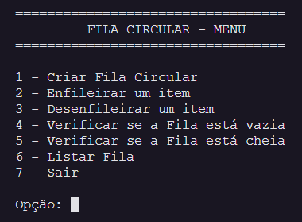

 

  <h1 align="center">Estruturas de Dados em Python</h1>

  

     Códigos que desenvolvi para a Disciplina de Estruturas de Dados do curso de Análise e Desenvolvimento de Sistemas - <a href="http://www.fateccarapicuiba.edu.br/">Fatec Carapicuíba</a>
     

  
Sumário

  <ol>
    <li>
      <a href="#💻-sobre">Sobre</a>
        <ul>
            <a href="#estruturas">Estruturas</a>
        </ul>
    </li>
    <li>
      <a href="#🛠-tecnologias-utilizadas">Tecnologias utilizadas</a>
    </li>
    <li>
    <a href="#✒️-autor">Autor</a>
    </li>
    <li>
    <a href="#📝-licença">Licença</a>
    </li>
    <li>
    <a href="#💜-agradecimentos">Agradecimentos</a>
    </li>
  </ol>

## 💻 Sobre

Este repositório foi criado com o objetivo de compartilhar os arquivos dos códigos desenvolvidos durante as aulas da disciplina de Estruturas de Dados, lecionada pelo Mestre José Luis Barboza Lobianco, para estimular o pensamento lógico e a aplicação das estruturas vistas em sala de aula.

### Estruturas

- [x] Fila Circular
- [ ] Pilha
- [ ] Vetor Ordenado
- [ ] Vetor Não Ordenado
- [ ] Big O

#### 1. Fila Circular

## 🛠 Tecnologias utilizadas

 

## ✒️ Autor

  
<a href="https://github.com/lilo-afk" ><b>Lilo-afk</b></a> <a title="Fino señores">🍷</a>

Feito com ❤️ por Murilo Martins Alves 👋🏽 Entre em contato!

---

## 📝 Licença

Este projeto está sobe a licença [MIT](./LICENSE.txt). Consulte `LICENSE.txt` para mais  informações.

## 💜 Agradecimentos

[Prof. José Luis Barboza Lobianco](https://www.instagram.com/barbozalobianco/)